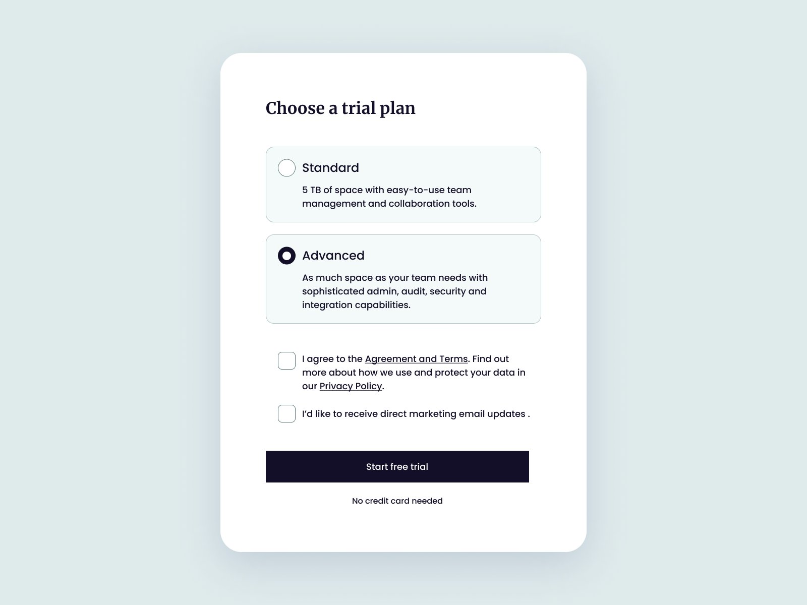

# Florin Pop Coding Challenge #3

My result from [@florinpop1705](https://twitter.com/florinpop1705) Coding Challenge with my redesign 😉👇

 

## Screenshot

## Original post 🐦

<blockquote class="twitter-tweet">
🔥 Coding Challenge #3!   Can you code this UI with HTML and CSS? (use a library if you want)  We&#39;ll play with some checkboxes today! 😠 Post your results below 👇  P.S. In the future these challenges will be available on <a href="https://t.co/QEy4A5wXz5">https://t.co/QEy4A5wXz5</a> <a href="https://twitter.com/hashtag/icodethis?src=hash&amp;ref_src=twsrc%5Etfw">#icodethis</a> (WIP atm) <a href="https://t.co/tOpbRQfUqY">pic.twitter.com/tOpbRQfUqY</a>
&mdash; Florin Pop 👨🏻‍💻 (@florinpop1705) <a href="https://twitter.com/florinpop1705/status/1599061607442571265?ref_src=twsrc%5Etfw">December 3, 2022</a></blockquote> 

 

## Resourses

- IBM Plex Serif
- IBM Plex Sans

with [Google Fonts](https://fonts.google.com/)

## Ideas
- [ ] Color scheme switcher using CSS

## License
MIT by [Wolney Oliveira](https://github.com/wolney-fo)
